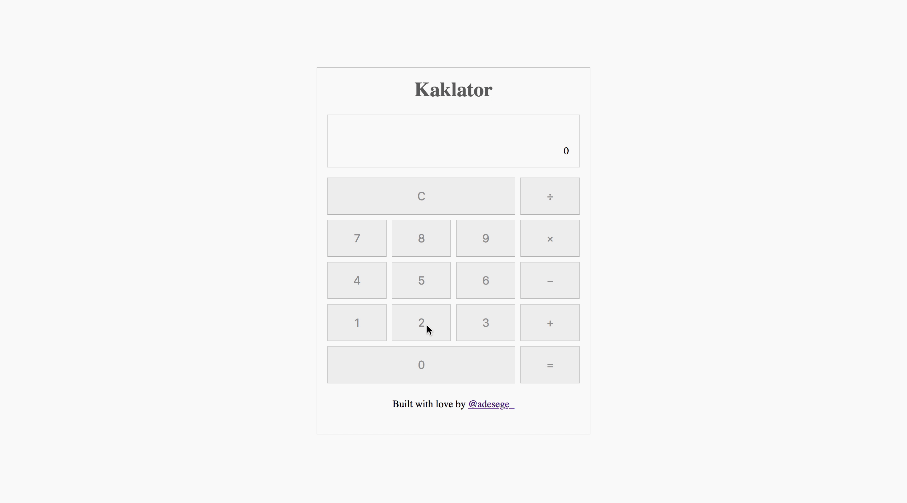

# Kaklator


> Kaklator is a simple vuejs app which uses the new css grid system for layouting.

Based on the [Code Challenge #2: Build a Calculator with CSS Grid](https://scotch.io/bar-talk/code-challenge-2-build-a-calculator-with-css-grid) challenge on Scotch.io

## Build Setup

``` bash
# install dependencies
npm install

# serve with hot reload at localhost:8080
npm run dev

# build for production with minification
npm run build

# build for production and view the bundle analyzer report
npm run build --report
```

## Author

[@adesege_](https://twitter.com/adesege_) is a software developer at Andela and he possess over 6 years experience as a Software Developer. Say hello [@adesege_](https://twitter.com/adesege_)

